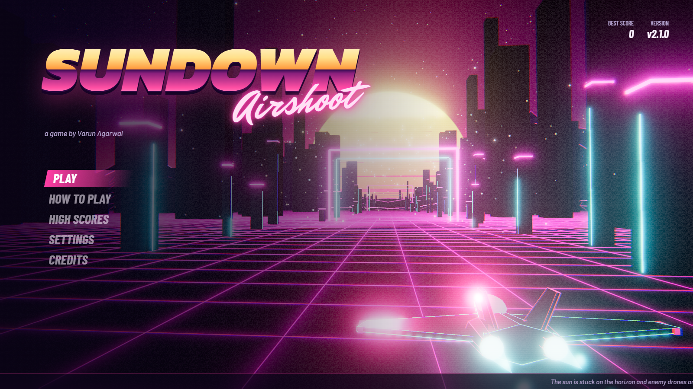
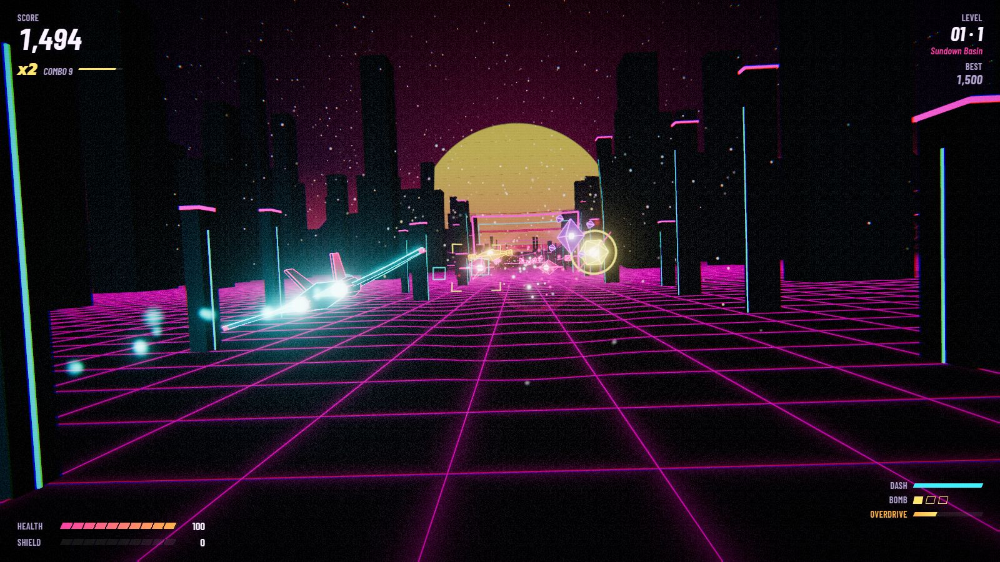
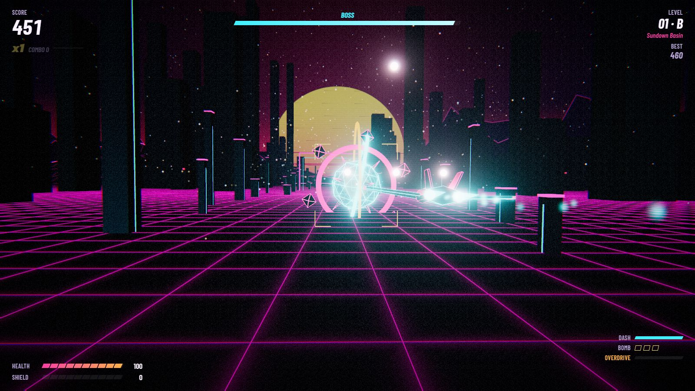
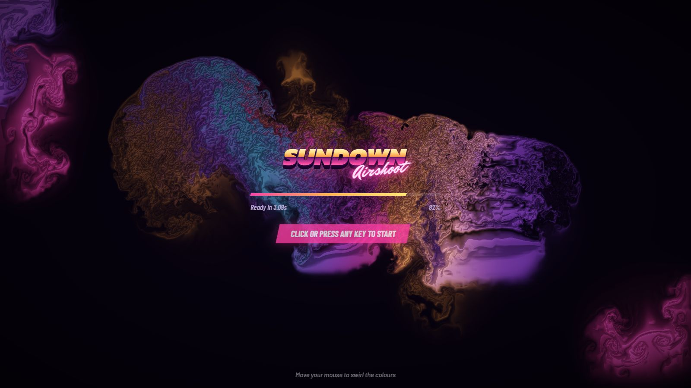

# Sundown Airshoot

A 3D arcade shooter that runs in the browser. You fly a small interceptor down a neon corridor at sunset, shoot down waves of drones, and fight a boss at the end of every level before warping to the next one. All graphics, music and sound effects are generated in code: there are no image, model or audio files in the game.



**Version 2.1** · made by Varun Agarwal for the JSS University game dev showcase.

**[Play it in your browser](https://varunagarwal11228.github.io/sundown-airshoot/)** (Edge or Chrome on a laptop/desktop)

## Screenshots

| | |
| --- | --- |
|  |  |
| Gameplay | Boss fight |
|  | |
| Loading screen (live fluid simulation) | |

The screenshots are taken by the game itself: open `dist/SundownAirshoot.html?shot=menu` (or `play` / `boss`) and it sets up that scene with no input, so a headless browser can capture it.

## Run it

| How | What to do |
| --- | --- |
| As an app | Double-click **Sundown Airshoot** on the Desktop (or `Play Sundown Airshoot.bat`). Opens in its own window, works offline. If you move the folder, double-click `Create Desktop Shortcut.bat` once to fix the Desktop icon. |
| As a file | Open `dist/SundownAirshoot.html` in Edge or Chrome. |
| From source | `python -m http.server 8000` in this folder (or `npm start`), then open `http://localhost:8000`. |

Press **F** in game for full screen. Nothing needs installing: three.js is already in `vendor/`.

## Controls

| Action | Keyboard / mouse | Gamepad |
| --- | --- | --- |
| Move | Mouse, or W A S D / arrow keys | Left stick / D-pad |
| Shoot (hold) | Left click or Space | A or right trigger |
| Dash (dodge, can't be hit) | Shift or right click | B or left bumper |
| Bomb (clears bullets) | E or Q | X or right bumper |
| Overdrive (when the bar is full) | R or middle click | Y |
| Pause | Esc or P | Start |

## Features

- **3D rendering with post-processing**: three.js scene with HDR bloom and a custom lens shader (chromatic aberration, shockwave refraction, warp blur, Overdrive colour grade, film grain, vignette).
- **Overdrive**: kills fill a meter. Press R for 6 seconds of bullet time: enemies and their bullets slow down, your fire rate nearly doubles and your shots pierce.
- **Homing missiles**, spread shot, rapid fire, shield, repair and bomb power-ups.
- **Five enemy types** (including the Splitter, which breaks into drones) and a **three-phase boss**.
- **Readable at speed**: enemies are lit in their own colours, the background dims during play, enemy bullets are white-hot, and the reticle brackets whatever you're locked onto without covering it.
- **Parallax scrolling**: star dome, three bands of space dust, three mountain ranges, a far city and near pylons all move at different speeds.
- **Fluid simulation loading screen**: a real-time GPU fluid solver (Navier-Stokes, raw WebGL2) that reacts to the mouse.
- **Spring-based flight**: the ship eases toward the aim point with a slight overshoot, banks, pitches and barrel-rolls on dash. The camera follows with its own lag, FOV kick and screen shake.
- **Procedural soundtrack**: synthwave music played live by a step sequencer, with separate tracks for menu, gameplay, boss and game over. All sound effects are synthesised too.
- **Wave director**: every wave is built from a points budget, so no two runs are the same. Easy, Normal and Hard difficulty.
- **Scoring**: combo multiplier up to ×8, no-damage bonuses, floating score popups, medals, local top-10 leaderboard.
- **Warp jump** between levels and four colour themes that fade into each other.
- **Demo mode**: leave the menu alone for 30 seconds and an AI pilot plays. Touch anything to take over.
- **Tutorial tips** for first-time players.
- **Adaptive resolution** when the frame rate drops.
- **Settings**: volumes, difficulty, background brightness, graphics quality, text style (simple English or sci-fi), text size, tips, screen shake, FPS counter. Saved between sessions.
- **Runs from one offline file**: a small Python build script packs every module, font and the icon into one HTML file.

## Tech stack

| Area | Used |
| --- | --- |
| Language | JavaScript (ES modules), GLSL, HTML, CSS |
| 3D engine | three.js r186 (WebGL2) |
| Shaders | Custom GLSL: sky, sun, grid floor, shield, particles, lens pass, fluid sim |
| Audio | Web Audio API (no libraries, no audio files) |
| Input | Pointer Events, Keyboard, Gamepad API |
| Storage | localStorage (settings, leaderboard) |
| Typography | Kanit, Barlow, Barlow Condensed, Mr Dafoe (bundled, SIL OFL) |
| Build | Python 3 (bundler + icon generator), no npm needed |
| Packaging | Edge/Chrome app window via shortcut, web app manifest for hosting |

## Project files

| File | What it is |
| --- | --- |
| `README.md` | This file |
| `CHANGELOG.md` | What changed in each version |
| `LICENSE` | MIT licence (plus third-party licences) |
| `package.json` | Project metadata and handy scripts (`npm start`, `npm run build`, `npm run icons`) |
| `manifest.json` | Web app manifest, so the hosted game can be installed like an app |
| `docs/GAME_DESIGN.md` | Game design document: mechanics, enemy stats, scoring, art and audio direction |
| `docs/PROJECT_CV.md` | Resume bullets, skills, pitch, LinkedIn post, numbers to quote |
| `docs/SHOWCASE_GUIDE.md` | Event checklist, 3-minute demo script, likely questions and answers |
| `Play Sundown Airshoot.bat` | Opens the offline build in its own app window |
| `Create Desktop Shortcut.bat` | Puts (or fixes) the Sundown Airshoot icon on the Desktop for wherever this folder is |
| `dist/SundownAirshoot.html` | The whole game in one file |

## How the code is organised

```
index.html             page shell and all UI screens
styles/main.css        all styling
src/
  main.js              boot: loader -> game -> menu
  config.js            tuning numbers (speeds, health, difficulty, colours per level)
  text.js              every line of on-screen text, in two styles
  core/
    Engine.js          renderer + post-processing chain
    Input.js           keyboard, mouse, gamepad, idle tracking
    Store.js           saved settings and leaderboard
    math.js            damping, easing, segment/point distance
  game/
    Game.js            state machine, main loop, collisions, scoring, camera
    Director.js        builds waves and runs the spawn timeline
    Autopilot.js       plays the game in demo mode
  world/
    Environment.js     sky, sun, grid floor, mountains, lights
    Parallax.js        stars, dust, city, pylons, gates
    Palette.js         colour themes and cross-fades
  entities/
    models.js          all meshes, built from code
    Player.js          spring flight, weapons, dash, shield, Overdrive
    Enemies.js         enemy behaviours and bullet patterns
    Boss.js            three-phase boss
    Bullets.js         pooled bullets on instanced meshes
    Missiles.js        homing missiles
    Pickups.js         power-ups
  fx/
    Particles.js       pooled GPU point particles
    Shockwaves.js      rings + screen-space ripple
    LensShader.js      final screen shader
    Reticle.js         aiming sights and lock-on brackets
  audio/
    AudioEngine.js     mixer, reverb, echo, compressor
    instruments.js     drum and synth voices
    Music.js           look-ahead step sequencer and songs
    Sfx.js             sound effects
  ui/
    FluidSim.js        WebGL2 fluid simulation
    Loader.js          boot screen
    Hud.js             in-game HUD, popups, tips
    Screens.js         menus, settings, game over, medals
tools/
  build.py             packs everything into dist/SundownAirshoot.html
  make_icon.py         draws the app icons (.ico and .png)
assets/                icons and fonts
vendor/three/          the parts of three.js the game uses
```

A few details worth knowing:

- **Frame loop.** `Game.tick()` runs once per frame: input, player, wave director, enemies, boss, bullets, missiles, pickups, collisions, then world scrolling, camera and rendering. Delta time is capped so a slow frame can't throw objects through walls. Two separate time scales drive slow motion on big moments and the Overdrive bullet time, which only slows enemies.
- **Collisions.** Bullets move up to 15 units per frame, so they are tested as line segments against spheres instead of points, which stops fast shots skipping through small enemies. Piercing Overdrive rounds remember the last thing they hit so they damage each target once.
- **Pooling.** Enemies, bullets, missiles, particles and shockwaves are created once and reused. Bullets are drawn with one instanced mesh per side, so hundreds of bullets cost two draw calls.
- **Demo mode.** The autopilot exposes the same interface as the real input (pointer, firing, dash), so the player code doesn't know who is flying. It chases the nearest target and predicts where incoming bullets will cross its plane to sidestep them.
- **Music timing.** JavaScript timers are not precise, so the sequencer wakes every 25 ms and schedules notes slightly ahead on the audio clock, which is sample-accurate.
- **Single-file build.** `build.py` rewrites each module's imports to names like `@sp/src/game/Game.js` and puts every module in an import map as a base64 `data:` URL. Browsers then load the whole game from one file, even from disk.

## Editing

- Change any wording in `src/text.js`.
- Change difficulty, speeds and colours in `src/config.js`.
- After editing, run `python tools/build.py` (or `npm run build`) to rebuild the offline file.

## Privacy

The game collects nothing. There are no accounts, analytics, cookies, ads or network requests while you play. Settings and the high-score table are saved only in your own browser (localStorage) and never leave your computer. Clearing your browser data, or Settings > Reset high scores, removes them.

## Credits

Design, code and audio by Varun Agarwal. Uses three.js (MIT licence) and the fonts Kanit, Barlow, Barlow Condensed and Mr Dafoe (SIL Open Font Licence). See `LICENSE`.
